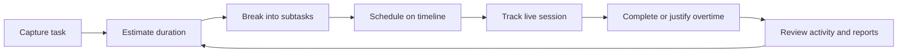
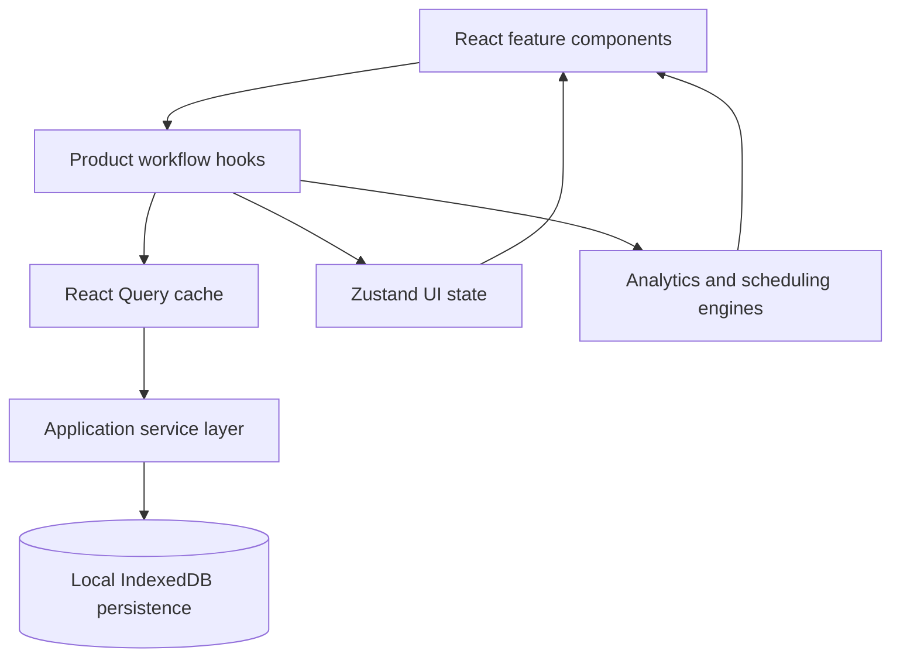
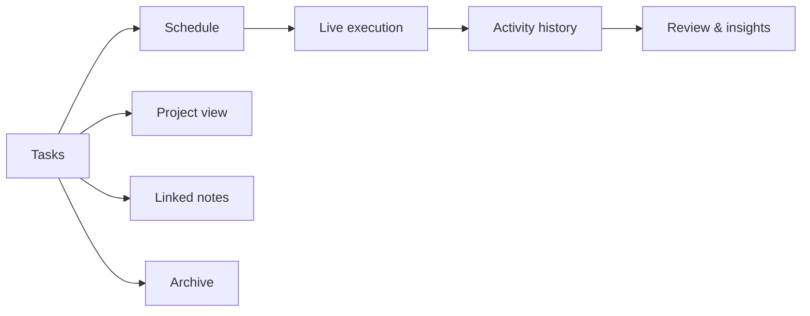

# 

Write.Set.Done! is a private, closed-source productivity application built around a simple idea:

Most people don't struggle because they lack motivation. They struggle because planning and execution are often disconnected.

Tasks get collected. Lists grow. Days become reactive. And over time, it becomes harder to understand where your time actually goes.

Write.Set.Done! was created to solve that problem.

---

## The Problem

Most productivity tools treat task capture as the end of the process.
In reality, that’s just the starting point.

### What actually goes wrong

People don’t struggle because they can’t write things down. They struggle because what happens after that is messy and unstructured.

Tasks, ideas, deadlines, and promises slowly accumulate in the background until everything starts to feel urgent at the same time. That creates a constant sense of overload.

Another issue is how we estimate work. We tend to assume things will take less time than they actually do. Without comparing expectations to reality, planning never really improves — it just repeats the same mistakes.

Then there is execution itself. You sit down to work, but instead of focusing, you drift back into planning, reorganizing lists, or reconsidering priorities. Planning and doing start to blend together, and focus gets lost in the process.

There is also a simple structural problem: time is limited, but task lists are not. A list can grow endlessly, while a day stays the same size.

And finally, most tools don’t make progress visible over time. Without that feedback loop, it’s hard to see how you actually work — what gets done, what gets delayed, and what keeps repeating.

### Why existing tools fall short

Different tools solve parts of the problem, but none of them close the loop:

* To-do apps help you capture tasks, but they don’t teach you how long things actually take.
* Calendar tools show time blocks, but they don’t understand the structure or weight of tasks.
* Time trackers measure duration, but they don’t connect that time back to planning decisions.
* Notes reduce mental load, but they don’t create any execution feedback.

### The real gap

Over time, the real issue becomes clear: there is a gap between what you think you can do and what actually happens in a day.

That gap quietly affects consistency, confidence, and the ability to plan realistically.

Write.Set.Done! was designed around making that gap visible — so planning and execution start to inform each other instead of staying separate.

---

## Building the System

### Scope

The scope covered the entire product:

* Defining the product direction and how the system should work in practice.
* Designing the full workflow, from capturing a task to reviewing completed work over time.
* Structuring the UI so that planning, execution, and reflection feel like one continuous loop.
* Designing the underlying data model for tasks, projects, events, notes, and activity history.
* Building a local-first persistence layer so user data stays on the device by default.
* Implementing scheduling, tracking, reporting, archiving, and notification flows.
* Shaping the visual language and messaging of the landing page.

### Technical Stack

* React
* TypeScript
* Tailwind CSS
* IndexedDB / Dexie
* Zustand
* TanStack Query
* dnd-kit
* Motion

---

### Core decisions

A few principles shaped almost every part of the system:

* Planning and execution are treated as two distinct modes of thinking, not one blended flow.
* Estimation is not a feature — it’s a skill the product is designed to train over time.
* Scheduled work represents real execution commitments, not just reminders.
* Data is stored locally first to keep the system fast and private.
* Every change in the system is traceable, so progress and mistakes remain visible over time.
* The architecture stays modular so the system can grow without becoming fragile or overly complex.

---

## Process / Approach

### The execution loop

The system is built around a single idea:
work should move through a clear, continuous execution loop - without cognitive friction between planning and doing.



This loop is the core of the product.

Everything else exists to support it:
planning, scheduling, tracking, and review are not separate features - they are stages of the same system.

---

### System layers

The application is split into three clear layers:

* Persistent data → tasks, sessions, notes, logs
* Application state → cached, derived, reactive data
* UI state → selections, modals, navigation, interactions

This separation prevents mixing long-term truth with temporary interaction state.


Key principle:
UI should never own business truth.

---

### User flow model

From the user perspective, the system behaves like a continuous sequence:

* capture work
* structure it
* schedule it in time
* execute it live
* review what actually happened


Each step produces input for the next one.

---

### Scheduling complexity (trust problem)

The scheduler is the most sensitive part of the system.

It supports:

* drag & drop
* resizing
* overlapping events
* multi-selection
* zoomed time scales
* live tracking inside events

But the real challenge is not interaction — it is consistency.

Rules that must always hold:

* no silent overlaps
* no invalid timeline states
* estimates remain respected
* changes must be predictable
* user mental model must stay stable

To ensure this, updates are always computed as a preview state first, then committed only if valid.

---

### Time tracking → feedback loop

Tracking is not just measurement — it is input for learning.

Each session connects to:

* a task
* a schedule block
* an estimated duration

When execution ends:

* actual time is compared to estimate
* deviation is recorded
* reflection is optionally captured

This turns time tracking into a learning system, not a stopwatch.

---

### State management strategy

State is intentionally split:

* persistent domain data → services + DB
* cached data → React Query
* UI interaction → Zustand
* derived insights → computed, not stored

This avoids mixing:

* temporary UI state
* long-term user data
* computed analytics

Result: predictable system behavior at scale.

---

## Results

### What the system makes possible

The product is built around a complete loop between planning, execution, and reflection:

* Tasks are no longer just collected — they are estimated, structured, and placed in time.
* Work is not assumed — it is tracked as it happens.
* Overruns are not ignored — they become part of the learning process.
* Past work is not lost — it is stored as a timeline of actual behavior.
* Planning is no longer abstract — it is tied directly to real execution data.

Over time, this turns work into something measurable and improvable, rather than something repetitive and unclear.

---

### Before vs after

| Before                                        | After                                                             |
| --------------------------------------------- | ----------------------------------------------------------------- |
| Work exists as an unstructured list of tasks. | Work is structured through estimation, scheduling, and execution. |
| Time is assumed rather than measured.         | Actual time is tracked and compared to estimates.                 |
| Overruns are forgotten or ignored.            | Overruns become explicit data points for reflection.              |
| Calendar and task systems are disconnected.   | Tasks and scheduled execution are part of the same flow.          |
| Progress is difficult to evaluate over time.  | History, reports, and activity logs make patterns visible.        |
| Planning and execution compete for attention. | Planning and execution are separated into distinct modes.         |

---

### How it is presented

The product experience is designed around a single idea:

> make execution visible

To support that, the interface focuses on a few core artifacts:

* a visual execution timeline,
* a scheduling view where time is treated as a finite resource,
* a live tracking layer that reflects work as it happens,
* and a review layer that shows patterns over time.

---

## What I Learned

### What worked well

A few decisions had a stronger impact than expected:

* Keeping logic inside feature-specific hooks made complex workflows easier to maintain and evolve.
* The activity timeline turned out to be more important than initially planned — it didn’t just show what happened, but revealed how work patterns change over time.

---

### Trade-offs

Every meaningful system introduces trade-offs:

* **Local-first vs multi-device sync:** local-first keeps things simple and private, but adding sync later would require careful conflict resolution and additional infrastructure.
* **Advanced scheduler vs complexity:** features like drag, resize, multi-select, and collision handling significantly improve UX, but introduce edge cases and implementation complexity.
* **Detailed logging vs simplicity:** rich activity history adds depth, but risks overwhelming the interface if not carefully designed.
* **Estimation discipline vs friction:** requiring estimates improves long-term planning quality, but increases onboarding friction if not explained properly.

---

### What I would improve next

If this system were to evolve further, a few areas would be next:

* Explore optional sync as a separate layer, without affecting the local-first core.
* Expand keyboard-first navigation for users who prefer faster, low-friction workflows.
* Add authentication layer for user identity management while keeping the core local-first architecture unchanged.
* Introduce WebSocket-based networking to enable real-time collaboration and multi-user synchronization features.

---

### What surprised me

The most unexpected insight was that the timer itself is not the most valuable part of the system.

The real value comes from the feedback loop around it.

Seeing planned time, actual time, overtime, project history, and monthly drift together changes how work is perceived — from something motivational and inconsistent into something that can actually be calibrated over time.

That shift was the core outcome of the product.

---

## Code Snippets & Development Cases

These examples are simplified and focus on the ideas behind the system rather than production-ready implementation details.

The goal is to show how certain product behaviors were designed and why they exist.

---

### Case 1 — Constraint-based calendar scheduling with snap + collision resolution
 
**Problem:** In a vertical timeline scheduler, users continuously drag and resize events.
This creates two hard constraints:
 
- UI must feel instant (smooth snapping while dragging)
- system must remain strictly valid (no overlaps)
The challenge is that both constraints happen at the same time: you cannot delay validation until "save", because the UI is already committed visually.
 
**Solution:** We solve this using a two-phase model:
 
1. **Interaction phase (optimistic UI)**
   - snap pointer position to time grid (5 / 10 / 15 min)
   - render immediately without validation blocking
2. **Commit phase (constraint validation)**
   - on drag end, run collision detection
   - either accept layout, or reject / adjust conflicting events

**Key Logic:**
 
```js
export function snapToGrid(yPixelOffset, pixelFactor, snapMinutes) {
  // yPixelOffset: raw cursor Y position in pixels from top of timeline
  // pixelFactor:  px-per-minute ratio (e.g. timeline height / 1440)
  // snapMinutes:  grid interval to snap to (5, 10, or 15)
 
  // Step 1: convert pixel offset → raw minutes in the day
  const rawMinutes = yPixelOffset / pixelFactor;
 
  // Step 2: round to the nearest snap interval
  // Math.round(x / snap) * snap is the canonical grid-snap formula —
  // works for any interval without special-casing
  const snapped = Math.round(rawMinutes / snapMinutes) * snapMinutes;
 
  // Step 3: clamp to [0, 1440]
  // 1440 = 24 × 60, the total minutes in one day.
  // Prevents events from being placed before 00:00 or after 23:59.
  const bounded = Math.max(0, Math.min(1440, snapped));
 
  return bounded;
}
 
export function hasCollision(target, events) {
  // Returns true if `target` overlaps with ANY other event in the list.
  // Uses Array.some() instead of filter() — short-circuits on the first
  // collision found, so it's O(1) best case, O(n) worst case.
 
  return events.some((e) => {
    // Skip the event being dragged: without this guard, `target` would
    // always collide with itself, making every drag invalid.
    if (e.id === target.id) return false;
 
    // Standard interval overlap check:
    //   A overlaps B  ⟺  A.start < B.end  AND  A.end > B.start
    // This correctly handles partial overlaps, containment, and adjacency
    // (adjacent events that share an endpoint are NOT considered overlapping).
    return (
      target.start < e.end &&
      target.end > e.start
    );
  });
}
```
 
**What This Demonstrates:**
 
- ✅ timeline is treated as a constrained system, not a free layout
- ✅ UI stays responsive via optimistic updates
- ✅ correctness is enforced at commit boundary, not during interaction
---
 
### Case 2 — High-performance productivity heatmap via O(1) indexing
 
**Problem:** The project overview renders:
 
- multiple projects
- 30–90 day grids
- per-day aggregated activity
Naively computed, this becomes **O(N × M × E)** recalculation per render, causing UI lag when data scales.
 
**Solution:** We remove runtime scanning by introducing pre-indexed lookup maps.
Instead of iterating raw arrays repeatedly, we transform data into hash maps first.
 
**Key optimisations:**
- events grouped by date
- tasks indexed by id
- heatmap computed from O(1) lookups

**Core Idea:**
 
```js
// Pre-index tasks by their id for O(1) lookup downstream.
// Without this, resolving task metadata inside loops would require
// repeated O(n) .find() calls — one per event.
const tasksById = new Map(tasks.map(t => [t.id, t]));
 
// Output map: composite key "color-date" → { minutes, count }
// Flat structure keeps iteration simple at render time.
const heatmap = new Map();
 
projects.forEach(project => {
  // Build a per-project date index scoped inside this loop iteration.
  // Keeping it scoped prevents cross-project event bleed.
  // key: ISO date string (e.g. "2024-03-15")  value: event[]
  const eventsByDate = new Map();
 
  project.events.forEach(e => {
    // Lazy bucket initialisation: only create the array on first encounter.
    // Alternative: eventsByDate.get(e.date) ?? eventsByDate.set(...).get(e.date)
    // — but this explicit form is easier to read.
    if (!eventsByDate.has(e.date)) {
      eventsByDate.set(e.date, []);
    }
    eventsByDate.get(e.date).push(e);
  });
 
  days.forEach(day => {
    // O(1) Map lookup — the critical optimisation.
    // At 90 days × 20 projects × 500 events, this is the difference between
    // ~900 k and ~1 800 total operations compared to a naive nested scan.
    const events = eventsByDate.get(day) || [];
 
    // Composite key namespaces projects in a single flat Map.
    // Alternative: nested Map<project, Map<date, …>> — flat is simpler
    // when data is only read, not mutated after construction.
    heatmap.set(`${project.color}-${day}`, {
      // reduce() with seed 0 handles empty arrays gracefully.
      // Without the seed, reduce() on an empty array throws a TypeError.
      minutes: events.reduce((a, b) => a + b.minutes, 0),
      count: events.length
    });
  });
});
```
 
**What This Demonstrates:**
 
- ✅ turning nested loops into indexed lookups
- ✅ rendering becomes independent of dataset size
- ✅ performance is moved from runtime → memoisation phase
---
 
### Case 3 — Linear-time hierarchical aggregation for nested task systems
 
**Problem:** Tasks are structured hierarchically:
 
- Project
  - Task
    - Subtask
Calculating metrics naively requires repeated recursion + filtering, resulting in **O(N²)** behaviour under real datasets. This becomes slow in reporting views.
 
**Solution:** We flatten the hierarchy using a parent lookup map, then compute metrics in a single traversal pass.
 
**Core Approach:**
 
```js
// Build an inverted index: parentId → [children].
// This converts the tree from "child knows its parent"
// to "parent knows its children" — enabling top-down traversal.
// Building the index is one O(n) pass; each subsequent collect() call
// then costs O(descendants) rather than O(n-total).
const tasksByParent = new Map();
 
tasks.forEach(task => {
  // Root tasks (no parentId) are entry points, not children.
  // Callers invoke collect(rootId) to retrieve a full subtree.
  if (!task.parentId) return;
 
  // Same lazy-list pattern as Case 2.
  // Note: reading with get() then immediately re-set() is safe —
  // Map entries hold mutable references.
  const list = tasksByParent.get(task.parentId) || [];
  list.push(task);
  tasksByParent.set(task.parentId, list);
});
 
// Recursively collect all descendants of taskId.
// Returns a flat array in depth-first, pre-order:
// [child, grandchild, great-grandchild, sibling, …]
function collect(taskId) {
  // The || [] fallback handles leaf nodes cleanly —
  // flatMap([]) returns [] without any extra branching.
  const children = tasksByParent.get(taskId) || [];
 
  // flatMap(c => [c, ...collect(c.id)]) is the compact DFS idiom:
  // each call prepends the node before its own subtree,
  // and flatMap eliminates the intermediate nested arrays.
  //
  // ⚠ Stack depth: JS call stacks are limited (~10k frames in V8).
  // For trees deeper than ~1k levels, convert to an iterative stack loop.
  // Real-world task hierarchies rarely exceed 5–6 levels, so
  // recursion is safe here.
  return children.flatMap(c => [c, ...collect(c.id)]);
}
```

## Interesting Development Notes

Some of the most important insights came directly from building the system, not from planning it.

* The scheduler quickly became the technical center of the product. What started as simple drag-and-drop evolved into handling grouped movements, resizing within constraints, collision previews, zoom stability, and keeping live tracking usable inside each event card.

* The activity log started as a debugging and audit tool, but naturally evolved into a user-facing layer that explains how an entire day actually unfolded.

* Monthly reporting forced stricter domain modeling. Tasks, subtasks, scheduled events, and tracked time all needed consistent rules so that analytics remained trustworthy over time.

* Import/export showed that plain text is often enough. A lightweight, human-readable format made it easier to bring real plans into the system without friction or lock-in.

* A local-first approach simplified trust and privacy, but naturally delayed multi-device sync, which remains a future architectural extension.

---


## Project Status

Write.Set.Done! is actively maintained as a private application.

The current focus is on improving workflow clarity, refining analytics, stabilizing the scheduler, and strengthening the onboarding experience so the execution loop is easier to understand from the first use.

---

## Ownership

This project is proprietary and closed source. All rights reserved.
